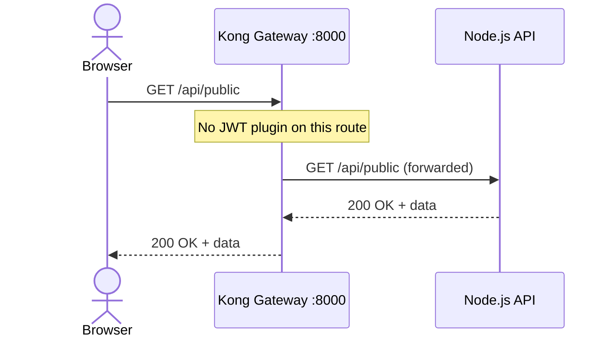
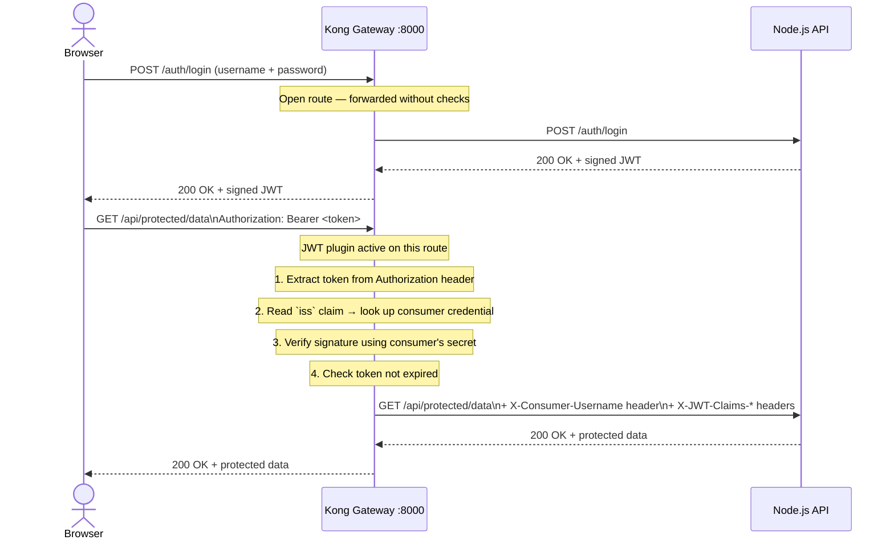
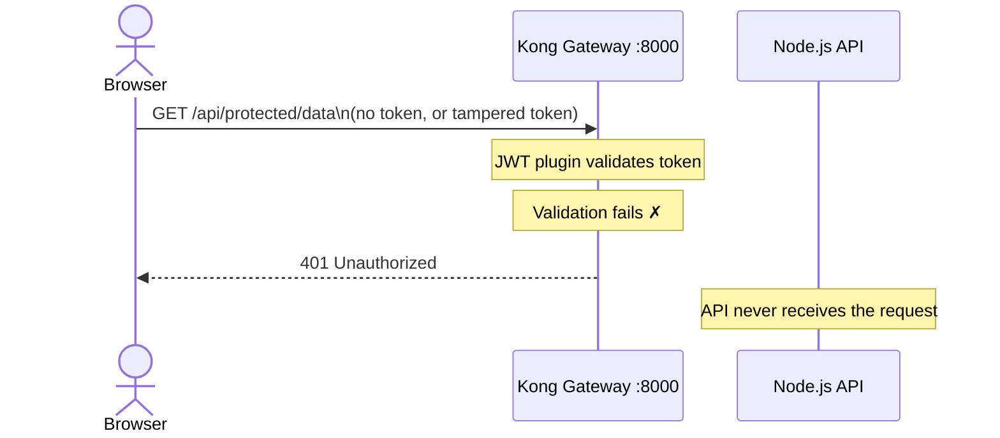
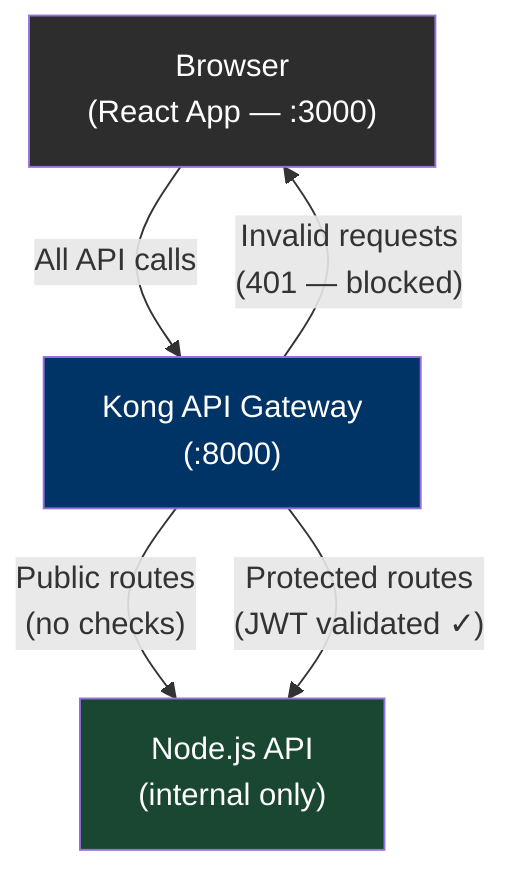

# Kong JWT Validation — Proof of Concept

This demo shows how **Kong API Gateway** can centrally enforce JWT authentication across API endpoints, keeping that responsibility out of your application code entirely.

A React web app lets you interactively explore the full flow: log in, receive a token, call protected and unprotected endpoints, and watch Kong block invalid requests — all without touching the Node.js API itself.

---

## How It Works

There are three distinct request flows. Kong sits in front of everything and decides what gets through.

### Flow 1 — Public request (no token required)



### Flow 2 — Authenticated request (happy path)



### Flow 3 — Invalid or missing token (blocked by Kong)



> **Key point:** The Node.js API contains no authentication code. Kong enforces all of that before a request ever reaches the application. The API simply trusts the headers Kong attaches.

---

## Architecture



**Three services, all in Docker:**

| Service | Port | Role |
|---|---|---|
| `web` | 3000 | React demo UI (served via nginx) |
| `kong` | 8000 | API gateway — validates JWTs, routes traffic |
| `api` | internal | Node.js API — never directly reachable from outside |

---

## Prerequisites

- [Docker Desktop](https://www.docker.com/products/docker-desktop/) installed and running
- Ports **3000** and **8000** free on your machine

---

## Running the Demo

```bash
# Clone or unzip the project, then:
cd kong-jwt-demo

docker compose up --build
```

First startup takes ~1–2 minutes as Docker pulls images and builds the containers. You'll know it's ready when you see:

```
kong-1  | ...Kong started
api-1   | API listening on port 3001
```

Open the demo in your browser: **http://localhost:3000**

---

## Walkthrough

### Step 1 — Call the public endpoint (no token needed)

Click **Call** next to `GET /api/public`.

The request goes through Kong, which lets it pass without checking any credentials. You'll see a JSON response from the API. This represents any endpoint you want to leave publicly accessible.

---

### Step 2 — Try a protected endpoint without logging in first

Click **Call** next to `GET /api/protected/data`.

Kong returns a **401 Unauthorized** immediately. The request never reaches the Node.js API. This is the core value: Kong acts as the gatekeeper so your application doesn't have to.

---

### Step 3 — Log in and get a JWT

In the left panel, use one of the demo accounts:

| Username | Password | Role |
|---|---|---|
| `alice` | `password123` | admin |
| `bob` | `letmein` | viewer |

Click **Login → Get JWT**. The auth endpoint (also behind Kong, but left open) issues a signed JWT. You'll see the raw token and its decoded claims (`iss`, `sub`, `role`, expiry) displayed in the sidebar.

---

### Step 4 — Call protected endpoints with your token

Now click **Call** on `GET /api/protected/data` and `GET /api/protected/profile`.

Both succeed. Kong reads the `Authorization: Bearer <token>` header, verifies:
1. The `iss` (issuer) claim matches a known consumer
2. The signature is valid using that consumer's secret
3. The token is not expired

If all checks pass, Kong forwards the request and injects the verified claims as headers — the API reads the user's identity from those headers rather than re-validating the token itself.

---

### Step 5 — Test invalid tokens

Use the two buttons in the **"Test Invalid / Missing Token"** section:

- **Send tampered JWT** — a token with a valid-looking structure but an invalid signature. Kong returns 401.
- **Send no token** — a request with no `Authorization` header at all. Kong returns 401.

In both cases, the Node.js API receives nothing. The rejection is handled entirely at the gateway.

---

## How JWT Validation Is Configured in Kong

Kong is configured declaratively in [`kong/kong.yml`](kong/kong.yml) — no database required. The relevant section:

```yaml
routes:
  - name: protected-route
    paths:
      - /api/protected
    plugins:
      - name: jwt
        config:
          key_claim_name: iss   # Kong looks up the consumer by this claim
```

Kong stores a consumer credential with a `key` (matched against `iss`) and a `secret` (used to verify the signature). The Node.js auth service signs tokens using that same secret. This is the only shared configuration between Kong and the API.

```yaml
consumers:
  - username: demo-consumer
    jwt_secrets:
      - key: "kong-demo"
        secret: "demo-secret-change-in-production"
```

> **Note:** In production, secrets would be stored in a secrets manager (e.g. AWS Secrets Manager, HashiCorp Vault) and injected at runtime — not hardcoded in config files.

---

## Inspecting Kong's Admin API

Kong exposes an admin API at **http://localhost:8001** that you can query to inspect the live configuration:

```bash
# View all configured routes
curl http://localhost:8001/routes | jq

# View consumers
curl http://localhost:8001/consumers | jq

# View plugins active on the protected route
curl http://localhost:8001/plugins | jq
```

---

## Stopping the Demo

```bash
docker compose down
```

---

## Key Takeaways

- **Authentication is centralized.** The Node.js API contains zero auth logic. Swapping, upgrading, or disabling JWT validation is a config change in Kong — not a code change in every service.

- **The API is not directly reachable.** Only Kong's port is published. The application server is inside the Docker network and inaccessible from outside.

- **Kong can enforce the same policy across many services.** As you add more microservices, each one gets the same JWT protection by adding a route in `kong.yml` — no per-service implementation required.

- **Kong forwards verified identity to the API.** After validation, Kong injects the consumer's identity as request headers. The API can trust these headers because it's only reachable through Kong.
